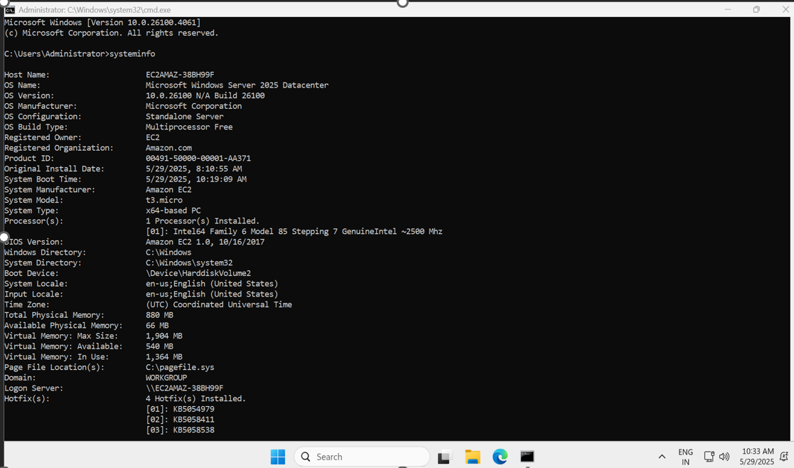

# AWS Task-1: Launch Windows VM & Collect System Info

##  Task Description
Create a Windows VM machine in AWS and connect with RDP, open CMD in Windows, and share the system info.

##  Tech Stack Used
- AWS EC2 (Windows Server 2025)
- RDP (Remote Desktop Protocol)
- Windows Command Prompt (`systeminfo`)

## 🖥 System Info Screenshot
Below is the output from `systeminfo` command in the Windows VM:

## 📅 Date Performed
May 29, 2025

